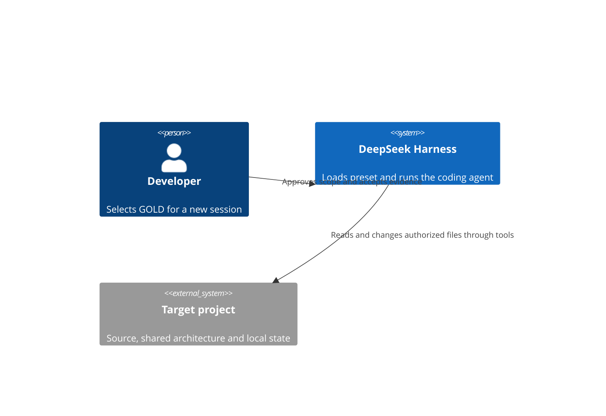
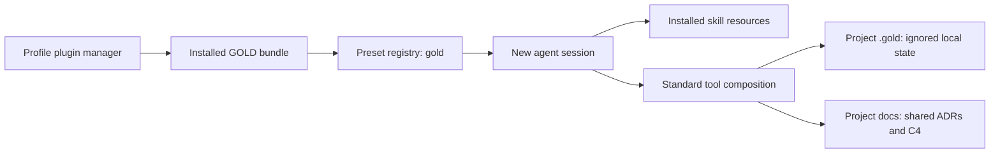

# GOLD preset architecture

This package is configuration and model-facing resources, not an independently deployed service.

## System context

## Runtime units and resources
A separate C4Container deployment view is not applicable to this declarative package: it introduces no process, network endpoint, database or container.

## Contracts and boundaries
- The package manifest declares the Loader patch. The patch inserts one preset and no global tool overrides.
- The preset retains Standard's planning, compaction and delegation isolation. Only persona and skill discovery configuration differ.
- Skill discovery resolves from the installed package; project skills can shadow the custom root.
- Model instructions guide behavior; they are not an enforcement layer. Runtime permissions and explicit user scope remain authoritative.
- Existing sessions retain their preset revision. Registration is not proof of behavioral compliance.
- Local state is not packaged and does not transfer through Git/worktrees. Shared docs must not rely on its availability.

## Validation
Source review against the manifest, declaration and resources; YAML parsed using the runtime's installed YAML library. Diagram syntax reviewed manually; no Mermaid renderer was run.

## Changes
| Change | Source |
|---|---|
| Initial declarative bundle baseline | package.json, cordis.patch.yml and packaged skill resources |
