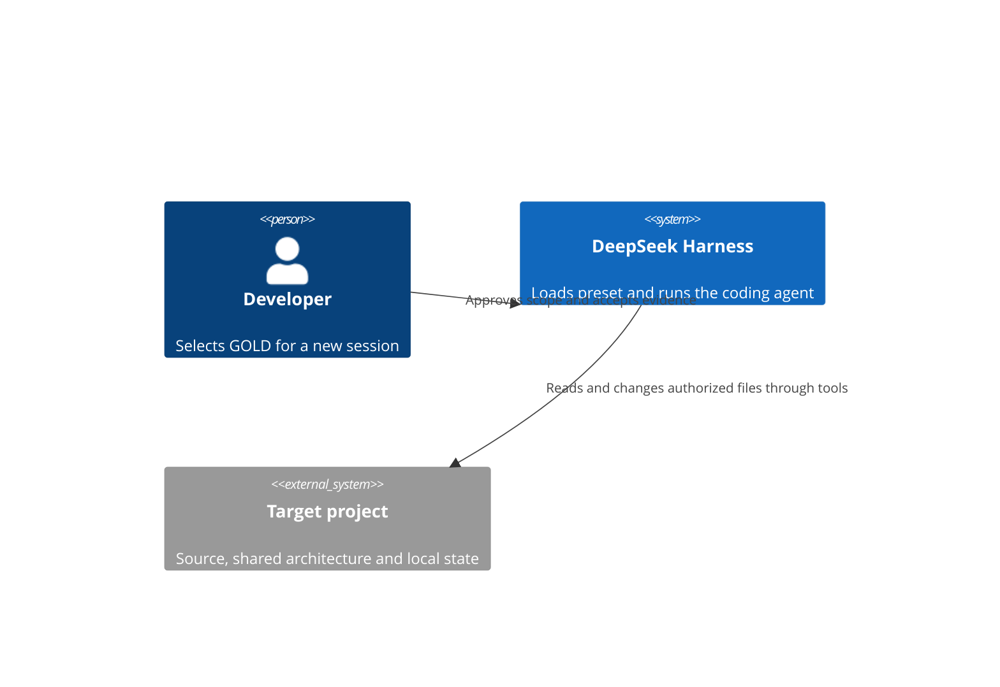
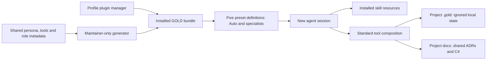
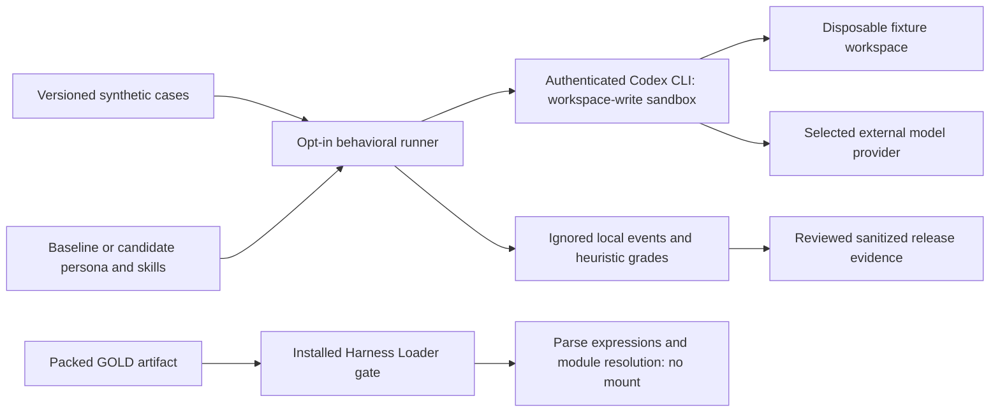

# GOLD preset architecture

This package is configuration and model-facing resources, not an independently deployed service.

## System context

## Runtime units and resources
A separate C4Container deployment view is not applicable to this declarative package: it introduces no process, network endpoint, database or container.

## Contracts and boundaries
- The package manifest declares a generated Loader patch inserting five ordinary presets and no global tool overrides. Legacy `gold` remains GOLD Development; `gold-auto`, `gold-architect`, `gold-reviewer` and `gold-devops` add entry points.
- Build-time source holds shared persona/tool composition and small role metadata. Installed packages require no generator or native preset inheritance. Freshness tests prevent source/artifact drift.
- One packaged router discovers seven outcome playbooks, relevant engineering references and an on-demand index of eight domain specialties. Adapted resources ship with third-party license notices.
- Repository-only Git metadata validation reads candidate commits and GitHub event JSON through argument-array subprocess calls; it adds no runtime service, permission mode or automatic Git action. Branch naming is advisory in CI; model identity detection is heuristic.
- The existing scenario routing remains outcome-driven. Collaboration styles and changing focus are instruction/state concepts, not runtime preset switches or permission changes.
- The preset retains Standard's planning, compaction and delegation isolation. Only persona and skill discovery configuration differ.
- Skill discovery resolves from the installed package; project skills can shadow the custom root.
- Model instructions guide behavior; they are not an enforcement layer. Runtime permissions and explicit user scope remain authoritative.
- Existing sessions retain their preset revision. Registration is not proof of behavioral compliance.
- Local state is not packaged and does not transfer through Git/worktrees. Shared docs must not rely on its availability.

## Maintainer validation boundary (since 1.3.0)

The repository-only evaluator starts an authenticated external CLI/model request only when explicitly invoked. It copies synthetic fixtures and selected resources into disposable workspaces, inspects tool-event traces and content differences, and retains raw logs locally. The provider sees the prompt/resources and synthetic fixture contents. Normal tests use no model requests. Neither evaluator nor runtime gate changes the active profile. Working-content fingerprints exclude ignored inputs and do not act as approval or locks. Execution ledgers and budgets remain instruction-level records, not services.

## Validation
Source review against the manifest, declaration and resources; packaged YAML parsed through the explicit installed runtime gate. Behavioral adapter runs are separate from mounted-session evidence. Diagram syntax reviewed manually; no Mermaid renderer was run.

## Changes
| Change | Source |
|---|---|
| Initial declarative bundle baseline | package.json, cordis.patch.yml and packaged skill resources |
| Adaptive entry points and shared generation | preset-src, scripts/build-presets.mjs and generated cordis.patch.yml |
| Scenario/style discovery and engineering guidance | packaged router, collaboration and scenario/engineering references |
