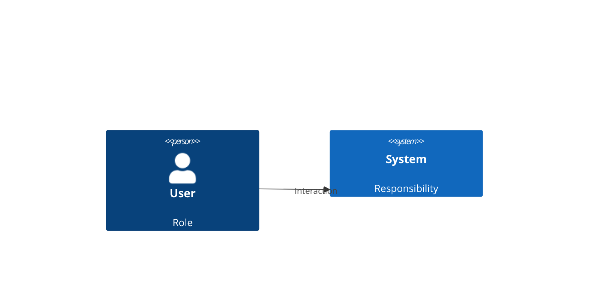

# Architecture — <project>
Shared current-state view. Decisions live in ADRs; factual corrections need no new ADR.

## System context

Replace placeholders using verified project facts; add real external dependencies only.

## Containers
Describe actual runnable/deployable units, stores and communication. Add a C4Container
view when applicable; for a library with no deployment boundary explain why this level
is not applicable rather than inventing services.

## Focused views
Link optional component/sequence views only where useful.

## Sources and validation
<source/config references, revision, renderer command/result or manual-only limitation>

## Changes
| Date | ADR / issue / commit / factual source | Change |
|---|---|---|
| ... | ... | baseline or correction |
