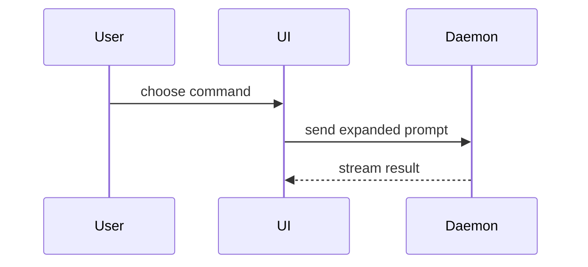

## GOLD / DSH integration contract

GOLD governs this skill and all supporting resources. Preserve approved scope, collaboration style, runtime plan mode, authorization, current verification evidence and C4 assessment. A conversational answer settles a design choice; it is not permission to implement, publish or bypass plan mode. Reuse valid approval rather than adding duplicate gates.

- Invoke reusable skills through the Harness skill tool. User-only skills (`disable-model-invocation: true`) stay user-invoked through the skill picker; suggest them instead of auto-loading them. Slash names denote skills, not installed native commands.
- Use Harness read, glob and grep tools for file inspection and ask_user_question for user-owned decisions. Use available subagent tools for delegation, with scoped briefs, ownership and parent verification; never assume Claude Task tools, worktrees, browser tools, tracker CLIs or credentials are available. If delegation is unavailable, disclose it and perform bounded independent passes.
- Never automatically commit, push, merge, reset, delete worktrees, create/publish PRs, change labels, close tickets or deploy. Obtain explicit action/target approval and load GOLD Git policy before Git mutations. Prepare drafts or proposals when publication is not authorized. Review findings do not authorize repairs.
- File writes, instrumentation, experiments and setup edits require scope covering their effects. Local plans, investigations, specs/tickets, research, handoffs and learning state default to gitignored repository-root .gold/ (not .scratch/, OS temp or tracked notes); read-only requests get inline reports. Shared ADRs, glossary and runbooks may stay tracked when explicitly approved. Preserve existing approved project conventions and never force-add local records or store secrets in them.
- Read existing project tracker/domain configuration when relevant. If missing, suggest setup-matt-pocock-skills and clarify the target; do not auto-run setup, invent a GitHub default, authenticate or create labels. Integration installation does not configure any project.
- Ponytail governs simplicity, not completeness: retain required tests and validation; deep modules and design alternatives must solve a demonstrated problem, not add speculative layers. Present HTML artifacts through Harness present; do not spawn replacement GUI servers or assume OS open commands work.

The contract above takes precedence over conflicting steps in the adapted upstream text and referenced resources.


Use this template for writing the PR body:

```markdown
## Summary

<diagram, diff-sketch, or tree>

## Evidence

- **Before:** <screenshot/output/failing test run>
  **After:** <screenshot/output/passing test run>

## Merge Danger

**Door:** <one-way or two-way>

<optional: description>

**Blast Radius:** <one-word description>

<optional: potential ramifications of merge>
```

## Sections

Skip all preambles and keep prose brief. Use the user's domain language from `GLOSSARY.md`.

### Summary

Pick the smallest view that makes the key point clear.

- Show logic or an algorithm as pseudocode:

```text
on(save)
  if content is unchanged
    return cached result
  write new content
  return fresh result
```

- Show runtime control flow as a call tree:

```text
submitForm
  createSession
    persistPrompt
    launchAgent
  navigateToSession
```

- Show UI structure as a component tree, including state and module boundaries that matter:

```text
<SessionPage> (apps/example/src/routes/session.tsx)
  useSessionEvents()
  <SessionToolbar>
    <RunSkillButton> (packages/ui)
```

- Show file responsibility or a broad refactor as a shallow file tree:

```text
src/
├── commands/       # parses user actions
├── sessions/       # owns session state
└── transport/      # sends API requests
```

- Show component interaction, control flow, or data flow with Mermaid:



- Use `diff` when the point is what changes and the surrounding shape already exists. Match the diff shape to the topic.

For a component change:

```diff
 <SessionPage>
   useSessionEvents()
   <SessionToolbar>
+    <RunSkillButton />
   <SessionTimeline>
+    <SkillResultCard />
```

For a file-layout change:

```diff
 src/
 ├── commands/
+│   └── show-me.ts       # expands the slash command
 ├── sessions/
-└── transport.ts
+└── transport/
+    ├── client.ts
+    └── stream.ts
```

For a call-tree or call-stack change:

```diff
 submitForm
   createSession
     persistPrompt
+    expandSkillMention
     launchAgent
-  navigateToSession
+  navigateToSession
+    subscribeToEvents
```

For a state or control-flow change:

```diff
 on(save)
-  write content
+  if content is unchanged
+    return cached result
+  write new content
+  invalidate cache
```

- Show the whole block when most of it is new, when omitted context would hide ownership or order, or when the user needs a copyable target shape:

```ts
function expandSkill(command: string): string {
  const skillName = command.slice(1);
  return `use the ${skillName} skill`;
}
```

#### Guidance

Place each visual next to the short text it supports. Keep only the calls, files, props, states, and boundaries needed to answer the user's current question or the options to resolve the current discussion point.

You may use one of these, you may use several, it is unlikely you will use all of them. Use your judgement and don't overwhelm the user.

### Evidence

Concrete evidence that the change works. Show a before and after.

Screenshots are S-tier - when the environment is set up for it and the change is visual.

Execution-based evidence is A-tier. Test results, console output. Show the exact test that now fails and passes, using pseudocode.

### Merge Danger

Describe whether it's a one-way or two-way door. You can walk back through two-way doors, but not one-way doors. A PR that is cheap to roll back is lower risk. Changes that involve destructive actions or hard-to-reverse decisions are one-way doors.

The blast radius is the potential impact or scope of the changes introduced by this PR. Consider all possibilities. Examples are layout shift, breakages for consumers, mobile responsiveness, etc.
